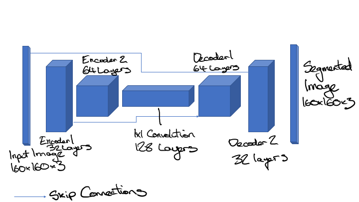

## Deep Learning Project ##

This project involved the building of a fully convolutional network (FCN) to which was trained to identify a target individual from a simulated drone camera feed.

The model is built within Tensorflow and Keras, and was trained using a [p2.xlarge AWS EC2 instance](https://aws.amazon.com/ec2/instance-types/p2/).

The original Udacity project repo is [here](https://github.com/udacity/RoboND-DeepLearning-Project).

## Architecture

The FCN is built to be able to segment objects within the video stream. This means that each pixel in the image needs to be labeled. Fully convolutional networks are capable of this via a process called semantic segmentation. The model is built such that the output image is the same size at the original input image, but each pixel in the output image is coloured one of N segmentation colours.

Semantic segmentation allows FCNs to preserve spatial information throughout the network.

### Fully Convolutional Networks

CNNs and FCNs both have an encoder section compromised of regular convolutions. Fully Convolutional Networks have a 1x1 convolution layer and a decoder section made of reversed convolution layers. Instead of a final fully connected layer, like a Convolutional Neural Network, every layer in an FCN is a fully convolutional layer.

A fully convolutional net tries to learn representations and make decisions based on local spatial input. Appending a fully connected layer enables the network to learn something using global information where the spatial arrangement of the input falls away and need not apply.

#### Encoder

The encoder section is comprised of one or more encoder blocks with each including a separable convolution layer.

Separable convolution layers are a convolution technique for increasing model performance by reducing the number of parameters in each convolution. A spatial convolution is performed, followed with a depthwise convolution. Separable convolutions stride the input with only the kernel, then stride each of those feature maps with a 1x1 convolution for each output layer, and then add the two together. This technique allows for the efficient use of parameters.

The encoder layers the model to gain a better understanding of the characeristics in the image, building a depth of understanding with respect to specific features and thus the 'semantics' of the segmentation. The first layer might discern colours and brightness, the next might discern aspects of the shape of the object, so for a human body, arms and legs and heads might begin to become successfully segmented. Each successive layers builds greater depth of semantics necessary for the segmentation. However, the deeper the network, the more computationally intensive it becomes to train.

#### 1x1 Convolution Layer

The 1x1 convolution layer is a regular convolution, with a kernel and stride of 1. Using a 1x1 convolution layer allows the network to be able to retain spatial information from the encoder. The 1x1 convolution layers allows the data to be both flattened for classification while retaining spatial information.

#### Decoder

The decoder section of the model can either be composed of transposed convolution layers or bilinear upsampling layers.

The transposed convolution layers the inverse of regular convolution layers, multiplying each pixel of the input with the kernel.

Bilinear upsampling is similar to 'Max Pooling' and uses the weighted average of the four nearest known pixels from the given pixel, estimating the new pixel intensity value. Although bilinear upsampling loses some details it is much more computationally efficient than transposed convolutional layers.

The decoder block mimics the use of skip connections by having the larger decoder block input layer act as the skip connection. It calculates the separable convolution layer of the concatenated bilinear upsample of the smaller input layer with the larger input layer.

Each decoder layer is able to reconstruct a little bit more spatial resolution from the layer before it. The final decoder layer will output a layer the same size as the original model input image, which will be used for guiding the quad drone.

#### Skip Connections

Skip connections allow the network to retain information from prior layers that were lost in subsequent convolution layers. Skip layers use the output of one layer as the input to another layer. By using information from multiple image sizes, the model retains more information through the layers and is therefore able to make more precise segmentation decisions.

### Model Used

The FCN model used for the project contains two encoder block layers, a 1x1 convolution layer, and two decoder block layers.

The first convolution uses a filter size of 32 and a stride of 2, while the second convolution uses a filter size of 64 and a stride of 2. Both convolutions used same padding. The padding and the stride of 2 cause each layer to halve the image size, while increasing the depth to match the filter size used, finally encoding the input within the 1x1 convolution layer uses a filter size of 128, with the standard kernel and stride size of 1.

The first decoder block layer uses the output from the 1x1 convolution as the small input layer, and the first convolution layer as the large input layer, thus mimicking a skip connection. A filter size of 64 is used for this layer.

The second decoder block layer uses the output from the first decoder block as the small input layer, and the original image as the large input layer, again mimicking the skip connection to retain information better through the network. This layer uses a filter size of 32.

The output convolution layer applies a softmax activation function to the output of the second decoder block.

## Hyperparameters

The optimal hyperparameters I found (for the time taken) are:

- learning rate = 0.0015
- batch size = 100
- number of epochs = 40
- steps per epoch = 200
- validation steps = 50
- workers = 2

Hyperparameters were found mostly via manual tuning and inspection. In future I would code the learning rate to decrease over time according to the differential of the validation loss over time and to undertake a performance-based search.

## Training

The model was trained using an AWS EC2 p2.xlarge instance (Nvidia K80 GPU with 4 vCPUs and 61 GB of RAM).

## Performance

The final score of my model is **0.412**, while the final IoU is 0.551.

## Future Enhancements

This model was trained on people, however, it could be used to train on any other objects of interest. For example, it could be trained on images of horses or trucks. The model could conceivably be trained on any set of labelled data large enough.
